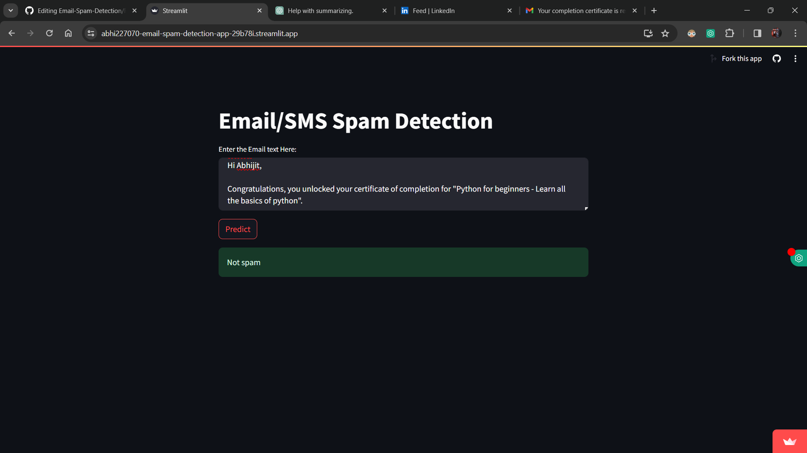

# Email Spam Classifier

Classify emails as spam or legitimate in real-time using natural language processing (NLP), data analytics, and machine learning (ML) techniques.

## Table of Contents

- [Introduction](#introduction)
- [Technologies/Tools Used](#technologies-tools-used)
- [Description](#description)
- [Installation](#installation)
- [Usage](#usage)
- [Screenshots](#screenshots)
- [Contributing](#contributing)
- [License](#license)

## Introduction

Email Spam Classifier is a real-time project designed to classify emails as spam or legitimate based on their text content. By leveraging NLP and ML algorithms, the classifier provides efficient and accurate results, helping users filter out unwanted emails effectively.

## Technologies/Tools Used

- Streamlit
- NLTK
- Pickle
- Python
- Scikit-Learn

## Description

This project utilizes a trained machine learning model to classify emails. The text entered by the user is preprocessed to remove stopwords, punctuation, and non-alphanumeric characters. It is then transformed using TF-IDF vectorization before being passed to the model for prediction. The model predicts whether the email is spam or not, and the result is displayed in real-time.

## Installation

1. Clone the repository:

    ```bash
    git clone https://github.com/your_username/email-spam-classifier.git
    ```

2. Install dependencies:

    ```bash
    pip install -r requirements.txt
    ```

## Usage

1. Run the Streamlit web application:

    ```bash
    streamlit run app.py
    ```

2. Enter the email text in the provided text area.
3. Click the "Predict" button to classify the email as spam or legitimate.

## Screenshots




## Contributing

Contributions are welcome! Please fork the repository and create a pull request with your proposed changes.

## License

This project is licensed under the [MIT License](LICENSE).
